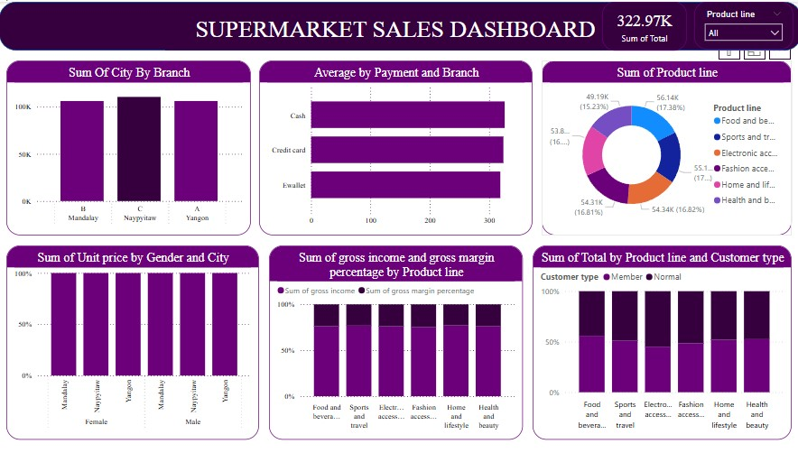

# 🛒 Supermarket Sales Analysis
Welcome to the **Supermarket Sales Analysis** project! This project explores transaction data collected from a supermarket operating across **three branches (A, B, and C)**, offering a wide range of products and accepting multiple payment methods.
## 📊 Project Overview
This analysis aims to uncover insights about customer behavior, product category performance, branch comparisons, and payment trends. By analyzing the data, we hope to guide strategic business decisions and improve operational efficiency.
--

### 🏬 Categories Sold
The supermarket sells a wide variety of products across the following main categories:
- **Health and Beauty**
- **Sports and Travel**
- **Home and Lifestyle**
- **Fashion Accessories**
- **Food and Beverages**
- **Electronic Accessories**

### 🏢 Branches
Data is collected from three main branches:
- **Branch A**
- **Branch B**
- **Branch C**

### 💳 Payment Methods
Customers can complete transactions using:
- **Cash**
- **E-Wallet**
- **Credit Card**
--
## 📚 Interpretation & Insights

Here are some key takeaways from the analysis:

- **Food and Beverages** is the most frequently purchased category across all branches.
- **Branch C** had the highest overall revenue, while **Branch A** saw more consistent footfall.
- **E-Wallet** payments are rising, especially among younger consumers.
- Peak shopping hours are typically between **4 PM and 7 PM**.
- **Electronic Accessories** tend to have higher average transaction values.
These insights can help with:
- Targeted marketing strategies
- Optimizing stock across branches
- Enhancing the customer payment experience
find the interpretation in:https://github.com/IdowuOyinkansola/surermarket_/blob/main/DATA_INTERPRETATION.docx
--
## 🧹 Cleaned Data
The raw data underwent several preprocessing steps to ensure accuracy and consistency:

- Removal of duplicate entries
- Handling of missing values
- Standardizing column formats (e.g., date, category names)
- Creation of new features (e.g., total spend, purchase time slots)

The cleaned dataset is stored in:https://github.com/IdowuOyinkansola/surermarket_/blob/main/supermarket_sales.csv
---

## 📈 Visualizations

Exploratory Data Analysis (EDA) and visual storytelling were performed using libraries such as **Matplotlib**, **Seaborn**, and **Plotly**. Key visualizations include:

- 📊 Sales distribution by product category
- 📍 Branch-wise revenue comparison
- 💰 Payment method usage analysis
- 🕒 Sales trend by time and date
- 📦 Product popularity ranking

Find the visual reports in:https://github.com/IdowuOyinkansola/surermarket_/blob/main/project_visualization.pbix
---
## Report\Presentations
this shows the reporst of the data
find the presentation in:https://github.com/IdowuOyinkansola/surermarket_/blob/main/PROJET_PRESETATION.pptx
--
thank you

